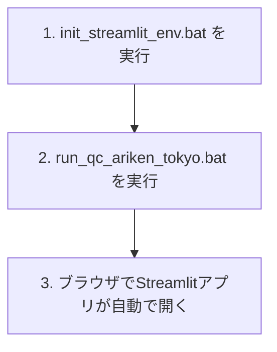

# QCアリケン東京システム バッチ起動手順書

## 1. 初期セットアップ

1. `init_streamlit_env.bat` をダブルクリックして実行します。
    - 初回のみ実行してください。
    - 仮想環境の作成と必要なパッケージのインストールが行われます。
    - コマンドプロンプトが開き、「初期設定が完了しました。」と表示されたらEnterキーを押して閉じてください。

## 2. アプリの起動

1. `run_qc_ariken_tokyo.bat` をダブルクリックして実行します。
    - 仮想環境が有効化され、Streamlitアプリが起動します。
    - ブラウザが自動で開き、QCアリケン東京のメインメニュー画面が表示されます。

## 3. 注意事項

- 2回目以降は「2. アプリの起動」だけでOKです。
- パッケージを追加・更新した場合は、再度 `init_streamlit_env.bat` を実行してください。
- エラーが出る場合は、コマンドプロンプトの内容を確認し、管理者にご連絡ください。

---

## 起動フロー図

