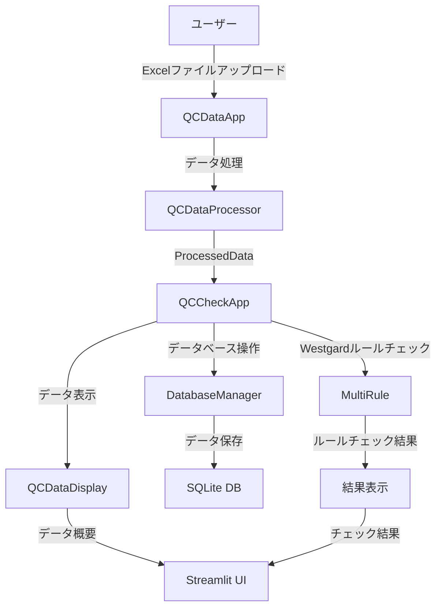

# 品質チェックアプリケーション 仕様書

## 1. システム概要

### 1.1 目的
本システムは、品質管理（QC）データの処理、データベース操作、Westgardルールによる品質チェックを行うためのアプリケーションです。

### 1.2 主要機能
- QCデータのアップロードと処理
- データベースへの保存
- Westgardルールによる品質チェック
- 結果の表示と分析

## 2. システム構成

### 2.1 主要コンポーネント

## 3. クラス仕様

### 3.1 QCCheckApp
#### 役割
品質チェックアプリケーションのメインクラス

#### 主要メソッド
| メソッド名 | 説明 | 引数 | 戻り値 |
|------------|------|------|--------|
| `run()` | アプリケーションのメイン実行 | なし | None |
| `process_data_batch()` | データの一括処理 | data: ProcessedData | dict |
| `handle_database_operations()` | データベース操作の処理 | data: ProcessedData | None |
| `process_and_display_westgard_results()` | Westgardルールチェックの処理と表示 | data: ProcessedData | None |

### 3.2 QCDataApp
#### 役割
QCデータの処理と表示を管理

#### 主要メソッド
| メソッド名 | 説明 | 引数 | 戻り値 |
|------------|------|------|--------|
| `run()` | アプリケーションの実行 | なし | Optional[ProcessedData] |
| `process_and_display()` | データの処理と表示 | uploaded_file, measurer | ProcessedData |

### 3.3 ProcessedData
#### 役割
処理されたQCデータのコンテナ

#### 主要属性
| 属性名 | 型 | 説明 |
|--------|------|------|
| `file_info` | pd.DataFrame | ファイル情報 |
| `ic_data` | pd.DataFrame | ICデータ |
| `nc_data` | pd.DataFrame | NCデータ |
| `pc_data` | pd.DataFrame | PCデータ |

## 4. データフロー

### 4.1 入力データ
- Excelファイル（測定結果）
- 測定者情報
- 日付範囲
- 責任区分

### 4.2 処理フロー
1. ユーザーによるデータアップロード
2. QCDataAppによるデータ処理
3. ProcessedDataへの変換
4. データベースへの保存
5. Westgardルールチェックの実行
6. 結果の表示

### 4.3 出力データ
- データ概要表示
- Westgardルールチェック結果
- データベース保存結果
- エラーメッセージ

## 5. エラーハンドリング

### 5.1 エラータイプ
| エラータイプ | 説明 | 処理方法 |
|------------|------|----------|
| データベースエラー | データベース操作時のエラー | エラーメッセージを表示し、処理を中断 |
| データ処理エラー | データ処理時のエラー | エラーメッセージを表示し、処理を中断 |
| 入出力エラー | ファイル操作時のエラー | エラーメッセージを表示し、処理を中断 |
| 実行時エラー | 予期せぬエラー | エラーメッセージを表示し、処理を中断 |

## 6. データベース構造

### 6.1 テーブル構成
| テーブル名 | 説明 |
|------------|------|
| `table_qc_file_info` | QCファイル情報 |
| `table_qc_nc` | ネガティブコントロールデータ |
| `table_qc_pc` | ポジティブコントロールデータ |
| `table_qc_check_log` | QCチェックログ |
| `qc_act_log` | QCアクティビティログ |

## 7. 画面仕様

### 7.1 メイン画面
- タイトル：精度管理資料結果確認
- レイアウト：wide
- 主要コンポーネント：
  - ファイルアップロード
  - 測定者選択
  - データ表示
  - 結果表示

### 7.2 サイドバー
- ファイルアップロード
- 測定者選択
- 日付範囲選択
- 責任区分選択 