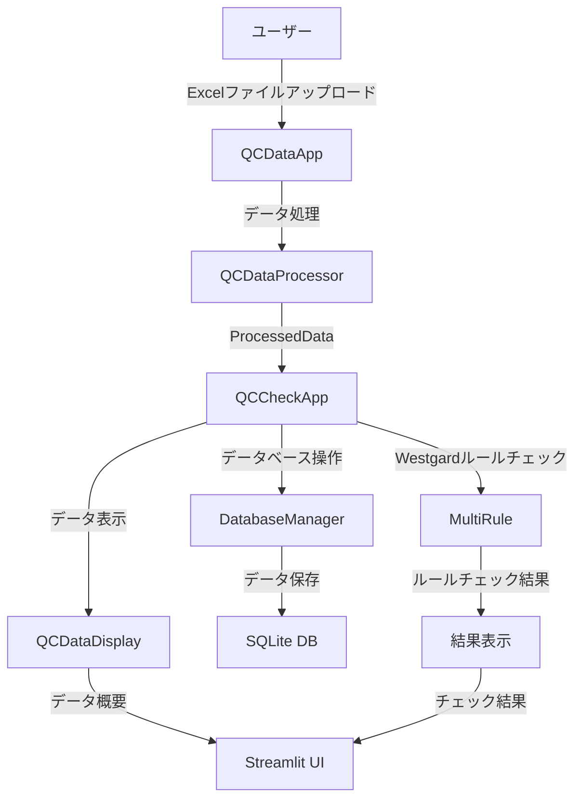

# 品質チェックアプリケーション 仕様書

## 1. システム概要

### 1.1 目的
本システムは、品質管理（QC）データの処理、データベース操作、Westgardルールによる品質チェックを行うためのアプリケーションです。

### 1.2 主要機能
- QCデータのアップロードと処理
- データベースへの保存
- Westgardルールによる品質チェック
- 結果の表示と分析

## 2. システム構成

### 2.1 主要コンポーネント


## 3. クラス仕様

### 3.1 QCCheckApp
#### 役割
品質チェックアプリケーションのメインクラス

#### 主要メソッド
| メソッド名 | 説明 | 引数 | 戻り値 |
|------------|------|------|--------|
| `run()` | アプリケーションのメイン実行 | なし | None |
| `process_data_batch()` | データの一括処理 | data: ProcessedData | dict |
| `handle_database_operations()` | データベース操作の処理 | data: ProcessedData | None |
| `process_and_display_westgard_results()` | Westgardルールチェックの処理と表示 | data: ProcessedData | None |

### 3.2 DatabaseManager
#### 役割
データベース操作を管理

#### 主要メソッド
| メソッド名 | 説明 | 引数 | 戻り値 |
|------------|------|------|--------|
| `get_connection()` | データベース接続を取得 | なし | sqlite3.Connection |
| `close()` | データベース接続を閉じる | なし | None |
| `save_qc_check()` | QCチェック結果を保存 | start_date: str, end_date: str, measurement: str, measurer: str, check_logs: List[Dict[str, str]] | bool |

### 3.3 QCCheckUI
#### 役割
QCチェックのUI管理

#### 主要メソッド
| メソッド名 | 説明 | 引数 | 戻り値 |
|------------|------|------|--------|
| `init_session_state()` | セッション状態を初期化 | なし | None |
| `render_sidebar()` | サイドバーのUIを描画 | なし | tuple[str, str, str, str] |
| `render_charts()` | チャートを描画し、QCログを生成 | なし | List[Dict[str, str]] |

## 4. データ構造

### 4.1 ProcessedData
#### 属性
- `file_info`: ファイル情報（DataFrame）
- `ic_data`: ICデータ（DataFrame）
- `nc_data`: NCデータ（DataFrame）
- `pc_data`: PCデータ（DataFrame）

### 4.2 データベーステーブル
#### table_qc_check_log
- `start_date`: 開始日
- `end_date`: 終了日
- `measurement`: 責任区分
- `measurer`: 測定者
- `type`: タイプ
- `check_result`: チェック結果
- `comment`: コメント
- `check_date`: チェック日時
- `date`: 日付

## 5. エラーハンドリング

### 5.1 エラーメッセージ
```python
ERROR_MESSAGES = {
    "database": "データベース操作中にエラーが発生しました: {}",
    "data_processing": "データ処理中にエラーが発生しました: {}",
    "io": "入出力処理中にエラーが発生しました: {}",
    "runtime": "実行時エラーが発生しました: {}"
}
```

### 5.2 エラー処理
- データベースエラー（sqlite3.Error）
- データ処理エラー（ValueError, TypeError）
- 入出力エラー（OSError, IOError）
- 実行時エラー（RuntimeError）

## 6. 使用技術
- Python 3.x
- Streamlit
- SQLite
- Pandas
- Mermaid（図表作成）

## 7. 画面仕様

### 7.1 メイン画面
- タイトル：精度管理資料結果確認
- レイアウト：wide
- 機能：
  - ファイルアップロード
  - データ表示
  - 結果表示

### 7.2 サイドバー
- ファイルアップロード
- 測定者選択
- 日付範囲選択
- 責任区分選択 