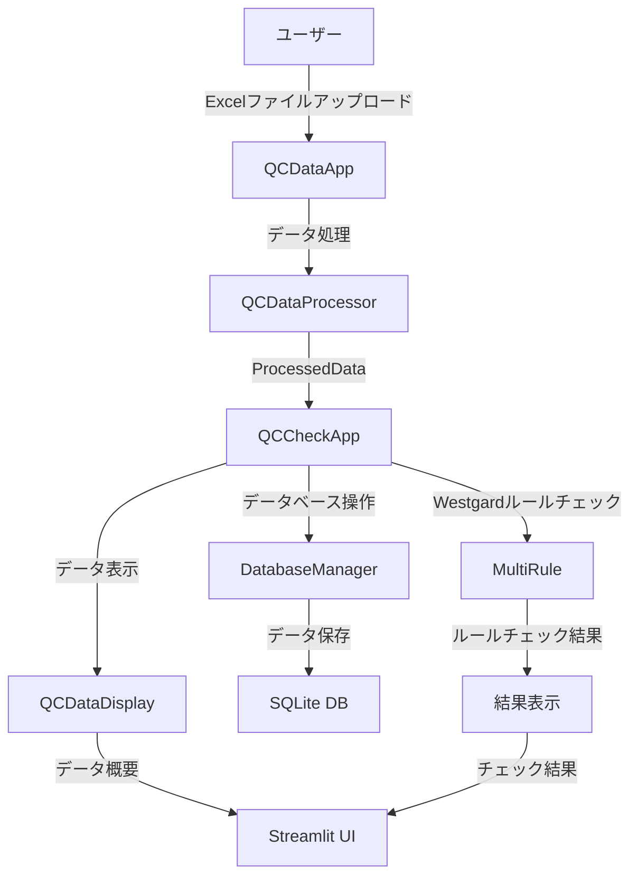

# 品質チェックアプリケーション システムドキュメント

## 目次
1. [データフロー図](#データフロー図)
2. [定義書](#定義書)
3. [仕様書](#仕様書)

## データフロー図

## 定義書

### 1. システム概要
- システム名：品質チェックアプリケーション
- 目的：QCデータの処理、データベース操作、Westgardルールのチェックを行う
- 主要機能：
  - QCデータのアップロードと処理
  - データベースへの保存
  - Westgardルールによる品質チェック
  - 結果の表示と分析

### 2. 主要クラス定義

#### 2.1 QCCheckApp
- 役割：品質チェックアプリケーションのメインクラス
- 主要メソッド：
  - `run()`: アプリケーションのメイン実行
  - `process_data_batch()`: データの一括処理
  - `handle_database_operations()`: データベース操作の処理
  - `process_and_display_westgard_results()`: Westgardルールチェックの処理と表示

#### 2.2 QCDataApp
- 役割：QCデータの処理と表示を管理
- 主要メソッド：
  - `run()`: アプリケーションの実行
  - `process_and_display()`: データの処理と表示

#### 2.3 ProcessedData
- 役割：処理されたQCデータのコンテナ
- 主要属性：
  - `file_info`: ファイル情報
  - `ic_data`: ICデータ
  - `nc_data`: NCデータ
  - `pc_data`: PCデータ

### 3. データフロー

#### 3.1 入力データ
- Excelファイル（測定結果）
- 測定者情報
- 日付範囲
- 責任区分

#### 3.2 処理フロー
1. ユーザーによるデータアップロード
2. QCDataAppによるデータ処理
3. ProcessedDataへの変換
4. データベースへの保存
5. Westgardルールチェックの実行
6. 結果の表示

#### 3.3 出力データ
- データ概要表示
- Westgardルールチェック結果
- データベース保存結果
- エラーメッセージ

### 4. エラーハンドリング
- データベースエラー
- データ処理エラー
- 入出力エラー
- 実行時エラー

### 5. データベース構造
- `table_qc_check_log`: QCチェックログ
- `table_qc_file_info`: ファイル情報
- `table_qc_nc`: NCデータ
- `table_qc_pc`: PCデータ
- `qc_act_log`: QCアクティビティログ

## 仕様書

### 1. システム要件

#### 1.1 動作環境
- OS: macOS 24.4.0以上
- Python: 3.8以上
- 主要ライブラリ:
  - streamlit
  - pandas
  - sqlite3
  - asyncio

#### 1.2 ハードウェア要件
- メモリ: 4GB以上
- ストレージ: 1GB以上の空き容量
- CPU: 2コア以上

### 2. 機能仕様

#### 2.1 データ入力機能
##### 2.1.1 ファイルアップロード
- 対応フォーマット: Excel（.xlsx, .xls）
- 必須カラム:
  - Ct
  - SD_Conversion
  - Type
  - Item_Code
  - Dye
  - Batch
  - Model
  - Date_Time

##### 2.1.2 測定者情報入力
- マスターファイル: `master_folder/employee_code.xlsx`
- 入力項目:
  - 測定者名（必須）
  - 責任区分（必須）
  - 日付範囲（必須）

#### 2.2 データ処理機能
##### 2.2.1 データ検証
- 必須カラムの存在確認
- データ型の検証
- 空値チェック
- 重複データチェック

##### 2.2.2 Westgardルールチェック
- 適用ルール:
  - IC: SD_Conversion = 2.0
  - NC: SD_Conversion = 3.0
  - PC: SD_Conversion = 2.5
- チェック項目:
  - 1-2sルール
  - 1-3sルール
  - 2-2sルール
  - R-4sルール
  - 4-1sルール
  - 10xルール

#### 2.3 データベース機能
##### 2.3.1 テーブル構成
1. `table_qc_file_info`
   - カラム:
     - Date_Time
     - Item_Code
     - Model
     - Measurer
     - Lot_Number

2. `table_qc_nc`
   - カラム:
     - Date_Time
     - その他測定データ

3. `table_qc_pc`
   - カラム:
     - Date_Time
     - その他測定データ

4. `table_qc_status_log`
   - カラム:
     - Date_Time
     - Measurer
     - Item_Code
     - Batch
     - 各種使用状況

##### 2.3.2 データベース操作
- データの挿入
- 重複チェック
- 履歴データの取得
- ステータスログの更新

#### 2.4 表示機能
##### 2.4.1 データ概要表示
- ファイル情報
- ICデータ
- NCデータ
- PCデータ
- 各データの件数表示

##### 2.4.2 詳細データ表示
- データフレーム表示
- チャート表示
- エクスパンダーによる詳細表示

##### 2.4.3 結果表示
- Westgardルールチェック結果
- エラーメッセージ
- 警告メッセージ
- 成功メッセージ

### 3. エラーハンドリング

#### 3.1 エラー種別
1. データベースエラー
   - 接続エラー
   - 整合性エラー
   - クエリエラー

2. データ処理エラー
   - 型エラー
   - 値エラー
   - 属性エラー

3. 入出力エラー
   - ファイル読み込みエラー
   - ファイル書き込みエラー

4. 実行時エラー
   - 予期せぬエラー
   - システムエラー

#### 3.2 エラー処理方法
- エラーメッセージの表示
- ログファイルへの記録
- ユーザーへの通知
- エラー発生時の適切な処理継続

### 4. セキュリティ要件

#### 4.1 データ保護
- データベースアクセス制御
- ファイルアクセス制限
- 機密情報の保護

#### 4.2 ユーザー認証
- 測定者情報の検証
- 責任区分による権限管理

### 5. パフォーマンス要件

#### 5.1 処理時間
- データアップロード: 5秒以内
- データベース操作: 3秒以内
- Westgardルールチェック: 2秒以内

#### 5.2 メモリ使用量
- 最大メモリ使用量: 1GB以下
- データベースサイズ: 500MB以下

### 6. 保守性要件

#### 6.1 ログ機能
- エラーログ
- 操作ログ
- デバッグログ

#### 6.2 バックアップ
- データベースバックアップ
- 設定ファイルバックアップ

### 7. インターフェース仕様

#### 7.1 ユーザーインターフェース
- レイアウト: ワイドレイアウト
- レスポンシブデザイン
- 日本語対応

#### 7.2 画面構成
1. メイン画面
   - タイトル
   - サイドバー
   - メインコンテンツ

2. サイドバー
   - 測定者選択
   - ファイルアップロード
   - 日付範囲選択
   - 責任区分選択

3. メインコンテンツ
   - データ概要
   - 詳細データ
   - 結果表示
   - エラーメッセージ

### 8. テスト仕様

#### 8.1 単体テスト
- 各クラスのメソッドテスト
- データ処理テスト
- データベース操作テスト

#### 8.2 結合テスト
- データフロー全体のテスト
- エラーハンドリングテスト
- パフォーマンステスト

#### 8.3 システムテスト
- エンドツーエンドテスト
- ユーザビリティテスト
- セキュリティテスト 