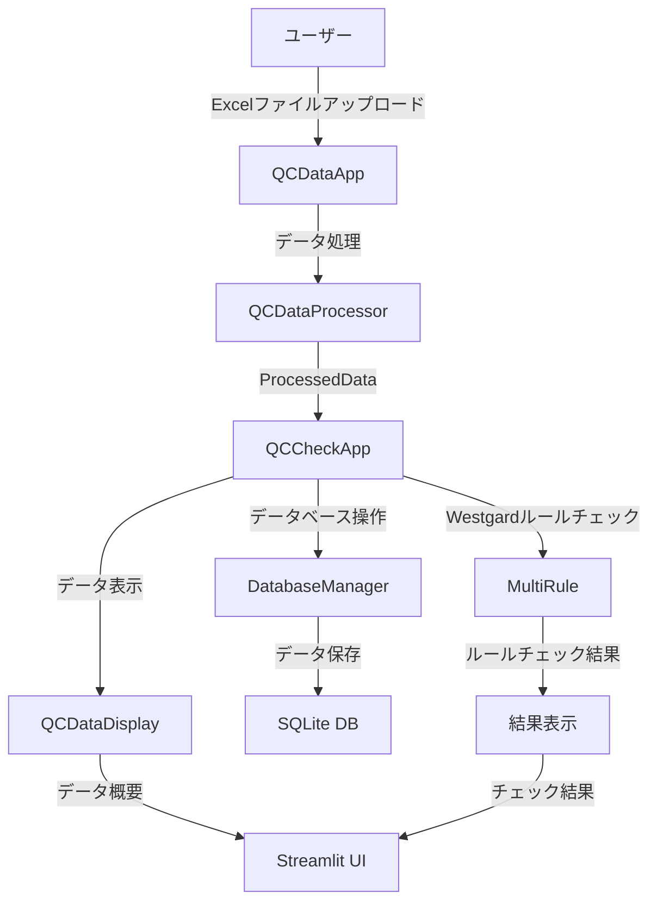

# 品質チェックアプリケーション システムドキュメント

## 目次
1. [データフロー図](#データフロー図)
2. [定義書](#定義書)
3. [仕様書](#仕様書)

## データフロー図

## 定義書

### 1. システム概要
- システム名：品質チェックアプリケーション
- 目的：QCデータの処理、データベース操作、Westgardルールのチェックを行う
- 主要機能：
  - QCデータのアップロードと処理
  - データベースへの保存
  - Westgardルールによる品質チェック
  - 結果の表示と分析

### 2. 主要クラス定義

#### 2.1 QCCheckApp
- 役割：品質チェックアプリケーションのメインクラス
- 主要メソッド：
  - `run()`: アプリケーションのメイン実行
  - `process_data_batch()`: データの一括処理
  - `handle_database_operations()`: データベース操作の処理
  - `process_and_display_westgard_results()`: Westgardルールチェックの処理と表示

#### 2.2 QCDataApp
- 役割：QCデータの処理と表示を管理
- 主要メソッド：
  - `run()`: アプリケーションの実行
  - `process_and_display()`: データの処理と表示

#### 2.3 ProcessedData
- 役割：処理されたQCデータのコンテナ
- 主要属性：
  - `file_info`: ファイル情報
  - `ic_data`: ICデータ
  - `nc_data`: NCデータ
  - `pc_data`: PCデータ

### 3. データフロー

#### 3.1 入力データ
- Excelファイル（測定結果）
- 測定者情報
- 日付範囲
- 責任区分

#### 3.2 処理フロー
1. ユーザーによるデータアップロード
2. QCDataAppによるデータ処理
3. ProcessedDataへの変換
4. データベースへの保存
5. Westgardルールチェックの実行
6. 結果の表示

#### 3.3 出力データ
- データ概要表示
- Westgardルールチェック結果
- データベース保存結果
- エラーメッセージ

### 4. エラーハンドリング
- データベースエラー
- データ処理エラー
- 入出力エラー
- 実行時エラー

### 5. データベース構造
- `table_qc_check_log`: QCチェックログ
- `table_qc_file_info`: ファイル情報
- `table_qc_nc`: NCデータ
- `table_qc_pc`: PCデータ
- `qc_act_log`: QCアクティビティログ 