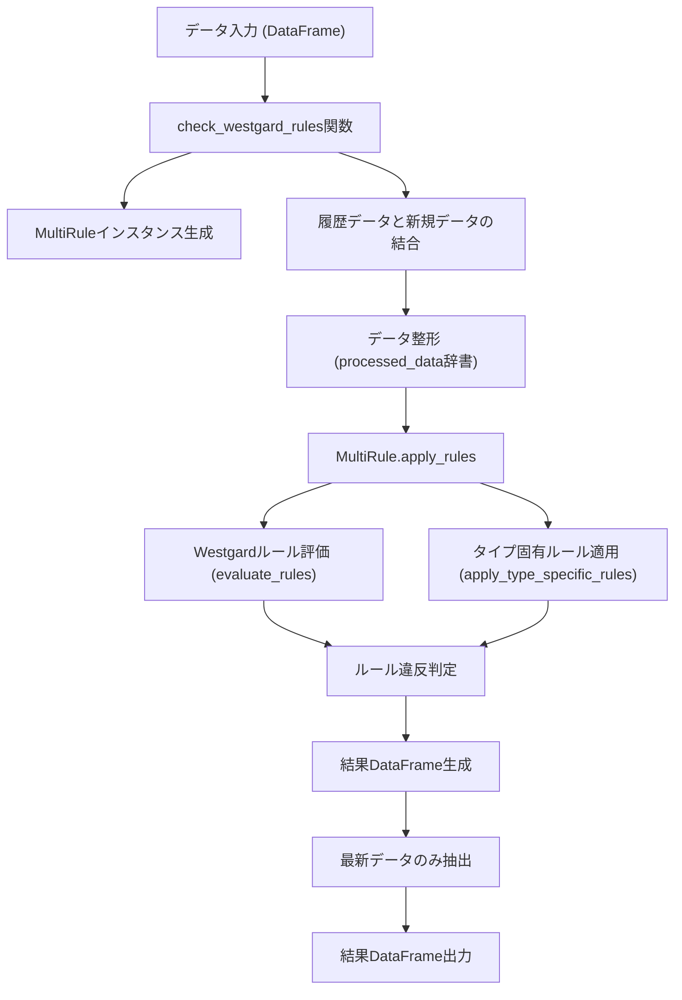
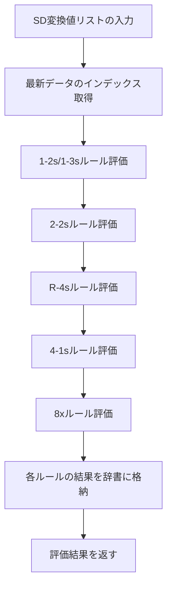

# Westgardルール データフロー

このドキュメントでは、`src/models/westgard_rules.py` におけるWestgardルール判定処理のデータフローを説明します。

---

## 全体フロー図

---

## 各処理の説明

### 1. データ入力 (DataFrame)
- QCデータ（および必要に応じて履歴データ）をPandas DataFrameとして受け取ります。

### 2. check_westgard_rules関数
- Westgardルール判定のエントリーポイント。
- DataFrameの整合性チェックや、MultiRuleクラスの初期化を行います。

### 3. MultiRuleインスタンス生成
- Westgardルールやタイプ固有ルールの条件を持つクラスを生成します。

### 4. 履歴データと新規データの結合
- 履歴データがあれば新規データと結合し、時系列順にソートします。

### 5. データ整形 (processed_data辞書)
- apply_rulesメソッドに渡すため、必要なカラムをリスト化して辞書にまとめます。

### 6. MultiRule.apply_rules
- 各データ点ごとにWestgardルール・タイプ固有ルールを適用し、判定結果を生成します。

### 7. Westgardルール評価 (evaluate_rules)
- 1-2s, 1-3s, 2-2s, R-4s, 4-1s, 8xなどのルールを判定します。

### 8. タイプ固有ルール適用 (apply_type_specific_rules)
- QCタイプごとに設定された独自ルール（例：SD変換値の閾値）を判定します。

### 9. ルール違反判定
- Westgardルールまたはタイプ固有ルールに違反しているかを判定します。

### 10. 結果DataFrame生成
- 判定結果をPandas DataFrameとしてまとめます。

### 11. 最新データのみ抽出
- 最新の測定日時のデータのみを抽出します。

### 12. 結果DataFrame出力
- 最終的な判定結果DataFrameを返します。

---

## 備考
- 本フローは`src/models/westgard_rules.py`の`check_westgard_rules`および`MultiRule`クラスの主要メソッドに基づいています。
- ルールや判定ロジックの詳細はコード内コメントも参照してください。

---

## Westgardマルチルール評価フロー

### フロー図

### 各ステップの説明

1. **SD変換値リストの入力**  
   - 評価対象となるSD変換値（標準偏差換算値）のリストまたは配列を受け取ります。
2. **最新データのインデックス取得**  
   - リストの末尾（最新データ）のインデックスを取得します。
3. **1-2s/1-3sルール評価**  
   - 最新データが2SD以上3SD以下（1-2s）、または3SD超（1-3s）かを判定します。
4. **2-2sルール評価**  
   - 直近2点がともに2SD以上かを判定します。
5. **R-4sルール評価**  
   - 直近4点の最大値と最小値の差が4SD以上かを判定します。
6. **4-1sルール評価**  
   - 直近4点がすべて1SD以上かを判定します。
7. **8xルール評価**  
   - 直近8点がすべて平均値の同じ側（正または負）にあるかを判定します。
8. **各ルールの結果を辞書に格納**  
   - 各ルールの判定結果（0または1）を辞書にまとめます。
9. **評価結果を返す**  
   - ルールごとの判定結果辞書を返します。 