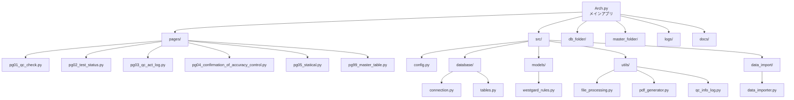
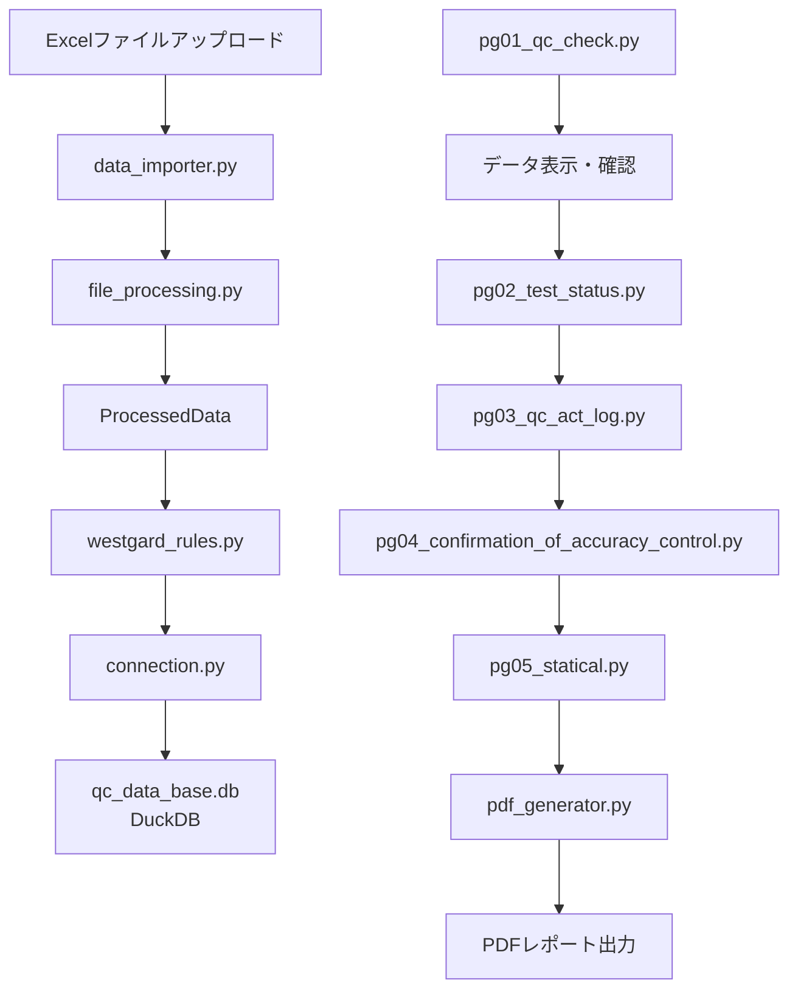

# QC有研東京プロジェクト 仕様書

## 1. ファイル・モジュール構成

---

## 2. 主要ファイルの役割と依存関係

| ファイル/ディレクトリ | 役割 | 主な依存先 |
|----------------------|------|------------|
| Arch.py | Streamlitメインアプリ | src/, pages/ |
| pages/pg01_qc_check.py | 管理試料測定結果登録・確認 | src/database, src/models, src/utils, src/data_import |
| pages/pg02_test_status.py | 測定状況登録 | src/database, src/config |
| pages/pg03_qc_act_log.py | 精度管理試料測定結果対応 | src/database, src/utils |
| pages/pg04_confirmation_of_accuracy_control.py | 精度管理実施状況確認 | src/database, src/utils |
| pages/pg05_statical.py | 統計学的精度管理確認・台帳作成 | src/database, duckdb, pandas, plotly, openpyxl |
| pages/pg99_master_table.py | マスターテーブル管理 | src/database, src/config |
| src/config.py | 設定・ロギング管理 | logging |
| src/database/connection.py | DB接続管理・テーブル定義 | src/config |
| src/database/tables.py | テーブル作成 | src/config |
| src/models/westgard_rules.py | Westgardルール実装 | src/database, pandas, numpy |
| src/utils/file_processing.py | QCデータ処理・表示 | pandas, streamlit, src/config |
| src/utils/pdf_generator.py | PDF生成 | src/config |
| src/utils/qc_info_log.py | QC情報ログ | src/config |
| src/data_import/data_importer.py | データインポート | pandas, src/utils.file_processing |

---

## 3. 主要クラス・関数・変数定義

### src/config.py

- **クラス: Config**
  - `DATABASE_PATH`, `MASTER_FOLDER`, `MAX_RECORDS_PER_TYPE` などの定数
  - `setup_logging()` : ロギング設定
- **グローバル変数**
  - `global_logger`（インスタンス化されたロガー）

---

### src/database/connection.py

- **グローバル変数**
  - `CREATE_TABLE_QUERIES` : テーブル作成SQL文の辞書
- **関数**
  - DB接続管理、テーブル作成

---

### src/database/tables.py

- **関数**
  - `create_tables(conn)` : 必要なテーブル（file_info, nc_data, pc_data）を作成

---

### src/models/westgard_rules.py

- **クラス: MultiRule**
  - `__init__(type_conditions, db_connection)`
  - `import_to_database(file_info, ic_data, nc_data, pc_data)` : DBへデータインポート
  - `apply_type_specific_rules(qc_type, sd_conversion_value)` : タイプ別ルール適用
  - Westgardルール判定ロジック

---

### src/utils/file_processing.py

- **データクラス: ProcessedData**
  - 属性: `file_info`, `ic_data`, `nc_data`, `pc_data`
  - `is_valid()`, `get_all_dataframes()`
- **クラス: QCDataProcessor**
  - `process_and_display(file, measurer)` : QCデータ処理・表示
  - `_get_file_info(file, measurer)` : ファイル名から情報抽出

---

### src/data_import/data_importer.py

- **クラス: DataImporter**
  - `process_and_display(file, measurer)` : QCデータ処理
  - `_get_file_info(file, measurer)` : ファイル名から情報抽出
  - `_process_data(uploaded_df, file_info)` : データ加工・分割

---

### pages/pg03_qc_act_log.py

- **クラス: DatabaseManager**
  - シングルトンDB接続管理
  - `get_connection()`, `close()`
- **クラス: MasterDataLoader**
  - マスターデータ読み込み・キャッシュ

---

### pages/pg02_test_status.py

- **関数**
  - `init_session_state()` : Streamlitセッション状態初期化
  - `ensure_table_exists()` : テーブル存在確認・作成

---

### pages/pg05_statical.py

- **関数**
  - `main()` : メイン処理（Streamlit自動実行）
  - `create_excel_report(df, year, month, return_wb=False)` : 年月指定でエクセルファイルを作成
    - データシートとグラフシートを含む内部精度管理台帳を生成
    - SD換算推移の折れ線グラフをTypeごとに作成
  - `create_excel_report_by_date_range(df, start_date_str, end_date_str, return_wb=False)` : 期間指定でエクセルファイルを作成
  - `display_type_data(conn)` : Type毎のデータを表示（未使用）
- **主要機能**
  - 年月指定によるデータ取得・表示
  - SD換算値のグラフ表示（Plotly使用、Typeごとに色分け）
  - 基本統計量の計算・表示（平均、標準偏差、変動係数、最小値、最大値、中央値、工程能力指数）
  - QCチェックログの表示（Typeごとにグループ化）
  - データ一覧の表示（項目名・Typeごとにグループ化）
  - 内部精度管理台帳のExcel出力（OpenPyXL使用）

---

## 4. 主要なデータ構造・変数の関係

- **ProcessedData**
  - 各種DataFrame（file_info, ic_data, nc_data, pc_data）を保持
  - QCデータ処理の中核
- **MultiRule**
  - type_conditions（辞書）を保持し、各QCタイプごとにWestgardルールを適用
- **DatabaseManager**
  - DB接続を一元管理し、各ページやモデルから利用

---

## 5. データフロー概要

---

## 6. 依存関係・技術スタック

- **主なライブラリ**: streamlit, pandas, numpy, duckdb, plotly, openpyxl, logging
- **DB**: DuckDB（SQLiteから移行）
- **データ管理**: Excel, DataFrame
- **グラフ描画**: Plotly Express
- **Excel操作**: OpenPyXL
- **ロギング**: RotatingFileHandler

---

## 7. 参考: データベーステーブル例

- `table_qc_file_info` : 測定ファイル情報
- `table_qc_ic` : ICデータ
- `table_qc_nc` : NCデータ
- `table_qc_pc` : PCデータ
- `file_info`, `nc_data`, `pc_data`（旧形式）

---

## 8. 付録

- 詳細な関数・クラスの引数や返り値、例外処理、各ページのUI要素等は各ファイルのdocstring・コメントを参照してください。

---

この仕様書は、プロジェクトの全体像・各ファイルの役割・主要なクラス/関数/変数の関係を俯瞰できるようまとめています。さらに詳細な関数仕様やデータ構造が必要な場合は、個別ファイルの内容を深掘りして追記可能です。
