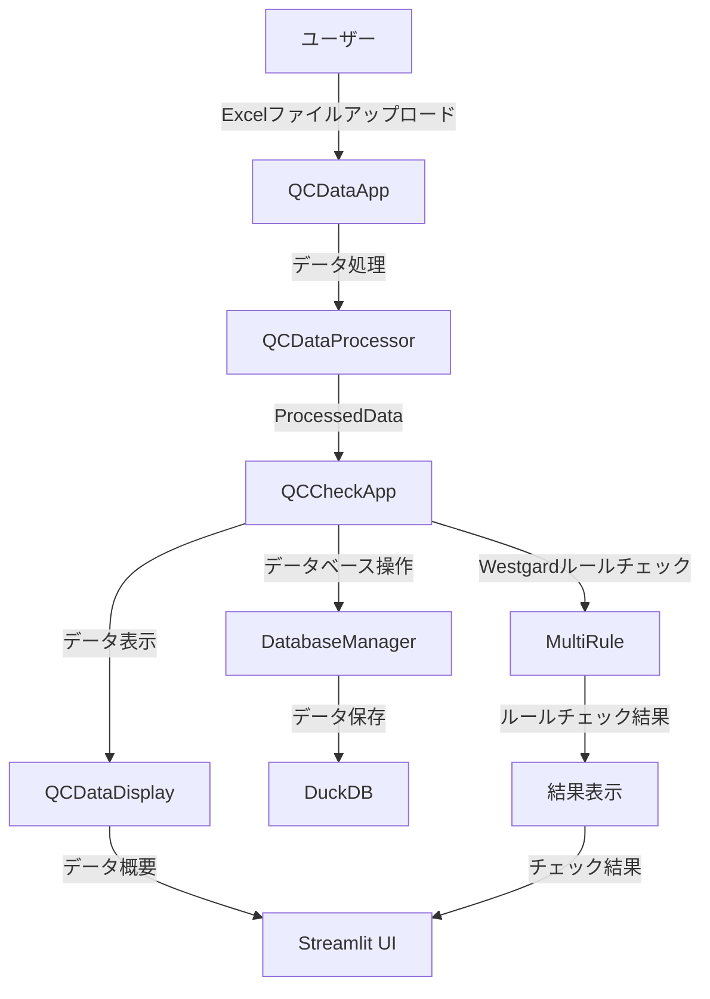

# 品質チェックアプリケーション システムドキュメント

## 目次
1. [データフロー図](#データフロー図)
2. [定義書](#定義書)
3. [仕様書](#仕様書)

## データフロー図

## 定義書

### 1. システム概要
- システム名：品質チェックアプリケーション
- 目的：QCデータの処理、データベース操作、Westgardルールのチェックを行う
- 主要機能：
  - QCデータのアップロードと処理
  - データベースへの保存
  - Westgardルールによる品質チェック
  - 結果の表示と分析

### 2. 主要クラス定義

#### 2.1 QCCheckApp
- 役割：品質チェックアプリケーションのメインクラス
- 主要メソッド：
  - `run()`: アプリケーションのメイン実行
  - `process_data_batch()`: データの一括処理
  - `handle_database_operations()`: データベース操作の処理
  - `process_and_display_westgard_results()`: Westgardルールチェックの処理と表示

#### 2.2 QCDataApp
- 役割：QCデータの処理と表示を管理
- 主要メソッド：
  - `run()`: アプリケーションの実行
  - `process_and_display()`: データの処理と表示

#### 2.3 ProcessedData
- 役割：処理されたQCデータのコンテナ
- 主要属性：
  - `file_info`: ファイル情報
  - `ic_data`: ICデータ
  - `nc_data`: NCデータ
  - `pc_data`: PCデータ

### 3. データフロー

#### 3.1 入力データ
- Excelファイル（測定結果）
- 測定者情報
- 日付範囲
- 責任区分

#### 3.2 処理フロー
1. ユーザーによるデータアップロード
2. QCDataAppによるデータ処理
3. ProcessedDataへの変換
4. データベースへの保存
5. Westgardルールチェックの実行
6. 結果の表示

#### 3.3 出力データ
- データ概要表示
- Westgardルールチェック結果
- データベース保存結果
- エラーメッセージ

### 4. エラーハンドリング
- データベースエラー
- データ処理エラー
- 入出力エラー
- 実行時エラー

### 5. データベース構造

#### 5.1 データベース種別
- **DuckDB**: 高性能な分析用データベース（SQLiteから移行）

#### 5.2 主要テーブル
- `table_qc_check_log`: QCチェックログ
- `table_qc_file_info`: ファイル情報
- `table_qc_nc`: NCデータ
- `table_qc_pc`: PCデータ
- `table_qc_ic`: ICデータ
- `table_qc_multi_rule`: マルチルール判定結果
- `table_qc_act_log`: QCアクティビティログ
- `table_qc_status_log`: ステータスログ

### 6. 統計学的精度管理機能 (pg05_statical.py)

#### 6.1 概要
統計学的精度管理の確認・台帳作成を行うページ。期間指定によるデータ取得、統計分析、グラフ表示、Excel出力機能を提供。

#### 6.2 主要機能
- **データ表示機能**
  - 年月指定によるデータ取得
  - SD換算値のグラフ表示（Typeごとに色分け、Plotly使用）
  - 基本統計量の計算・表示（平均、標準偏差、変動係数、最小値、最大値、中央値、工程能力指数）
  - QCチェックログの表示（Typeごとにグループ化）
  - データ一覧の表示（項目名・Typeごとにグループ化）

- **Excel出力機能**
  - 内部精度管理台帳の生成（データシートとグラフシート）
  - SD換算推移の折れ線グラフをTypeごとに作成（OpenPyXL使用）
  - グラフのY軸範囲を-5から5に設定

#### 6.3 主要関数
- `create_excel_report(df, year, month, return_wb=False)`: 年月指定でエクセルファイルを作成
- `create_excel_report_by_date_range(df, start_date_str, end_date_str, return_wb=False)`: 期間指定でエクセルファイルを作成
- `main()`: メイン処理（Streamlit自動実行）

#### 6.4 データ処理フロー
1. ユーザーが年月を入力
2. DuckDBから該当期間のデータを取得
3. マスターデータ（measurement_item.xlsx）と結合
4. SD換算値のグラフを生成・表示
5. 基本統計量を計算・表示（Lot Number、Typeごとに集計）
6. QCチェックログを表示
7. データ一覧を表示
8. Excel出力ボタンで内部精度管理台帳を生成 