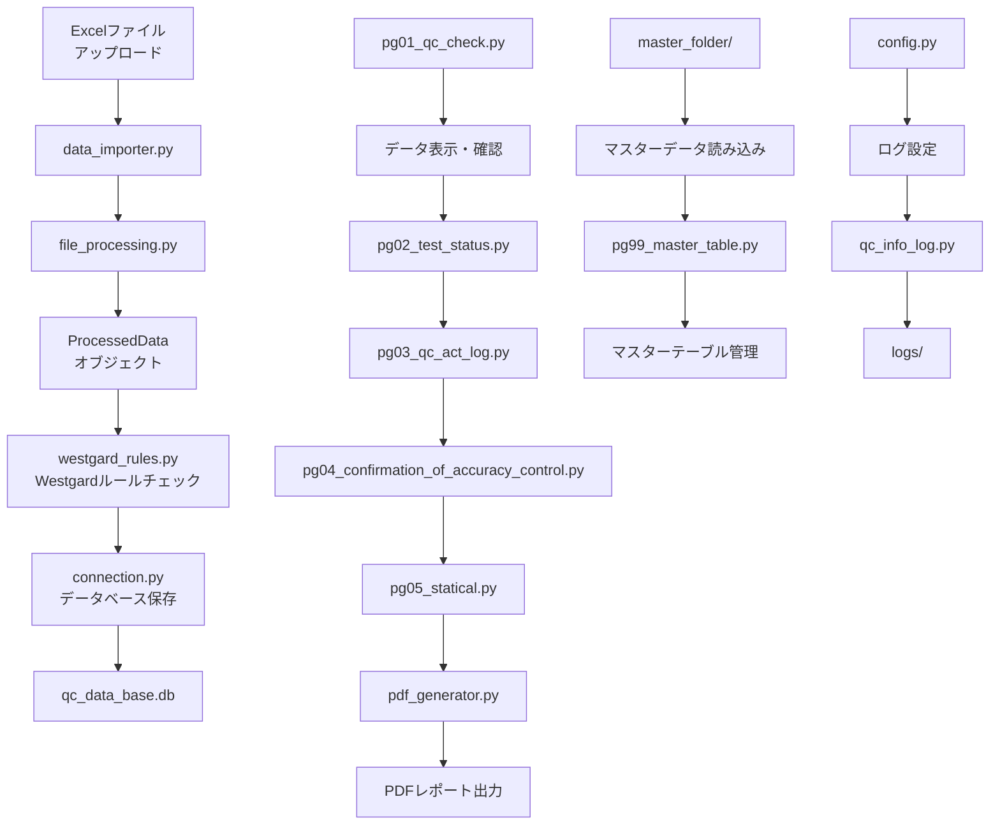
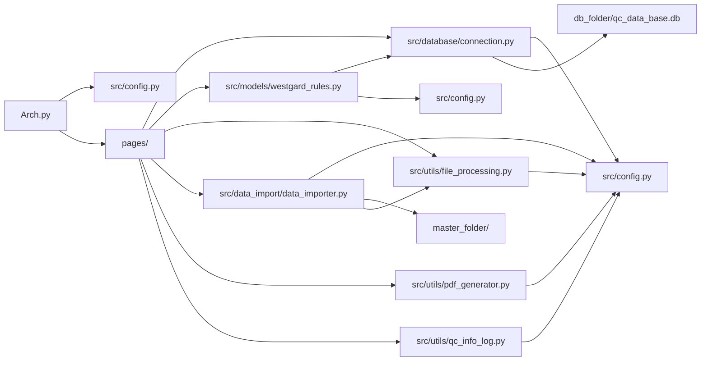
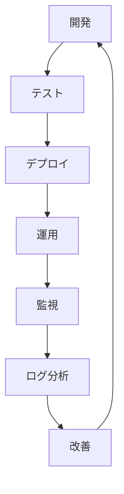

# QC有研東京プロジェクト構造図

## プロジェクト概要
株式会社株式会社 Lab.Archの精度管理システム（QCシステム）のファイル構造と関係性を示す図式です。

## システムアーキテクチャ

```mermaid
graph TB
    %% メインアプリケーション
    A[Arch.py<br/>メインアプリケーション<br/>Streamlitアプリ] --> B[pages/]
    A --> C[src/]
    A --> D[db_folder/]
    A --> E[master_folder/]
    A --> F[logs/]
    A --> G[docs/]
    
    %% ページモジュール
    B --> B1[pg01_qc_check.py<br/>管理試料測定結果登録・確認]
    B --> B2[pg02_test_status.py<br/>測定状況登録]
    B --> B3[pg03_qc_act_log.py<br/>精度管理試料測定結果対応]
    B --> B4[pg04_confirmation_of_accuracy_control.py<br/>精度管理実施状況確認]
    B --> B5[pg05_statical.py<br/>精度管理図出力]
    B --> B6[pg99_master_table.py<br/>マスターテーブル管理]
    
    %% ソースコード構造
    C --> C1[config.py<br/>設定・ロギング管理]
    C --> C2[database/]
    C --> C3[models/]
    C --> C4[utils/]
    C --> C5[data_import/]
    
    %% データベース層
    C2 --> C2A[connection.py<br/>データベース接続管理]
    C2 --> C2B[tables.py<br/>テーブル定義]
    
    %% モデル層
    C3 --> C3A[westgard_rules.py<br/>Westgardルール実装]
    
    %% ユーティリティ層
    C4 --> C4A[file_processing.py<br/>ファイル処理]
    C4 --> C4B[pdf_generator.py<br/>PDF生成]
    C4 --> C4C[qc_info_log.py<br/>QC情報ログ]
    
    %% データインポート層
    C5 --> C5A[data_importer.py<br/>データインポート]
    
    %% データベースファイル
    D --> D1[qc_data_base.db<br/>メインデータベース]
    D --> D2[qc_data_base.db-wal<br/>WALファイル]
    
    %% マスターファイル
    E --> E1[employee_code.xlsx<br/>従業員コード]
    E --> E2[measurement_item.xlsx<br/>測定項目]
    E --> E3[measuring_model.xlsx<br/>測定モデル]
    E --> E4[qc_control.xlsx<br/>QC制御]
    
    %% ログファイル
    F --> F1[app.log<br/>アプリケーションログ]
    F --> F2[qc_check.log<br/>QCチェックログ]
    
    %% ドキュメント
    G --> G1[specification.md<br/>仕様書]
    G --> G2[system_documentation.md<br/>システムドキュメント]
    
    %% 依存関係
    B1 -.-> C1
    B1 -.-> C2A
    B1 -.-> C3A
    B1 -.-> C4A
    B1 -.-> C5A
    
    B2 -.-> C1
    B2 -.-> C2A
    
    B3 -.-> C1
    B3 -.-> C2A
    B3 -.-> C4C
    
    B4 -.-> C1
    B4 -.-> C2A
    B4 -.-> C4B
    
    B5 -.-> C1
    B5 -.-> C2A
    B5 -.-> C4B
    
    B6 -.-> C1
    B6 -.-> C2A
    
    C2A -.-> D1
    C5A -.-> E
```

## データフロー図

## モジュール依存関係

## ファイル構造詳細

### ルートディレクトリ
- `Arch.py` - メインアプリケーション（Streamlit）
- `requirements.txt` - Python依存関係
- `generate_spec.py` - 仕様書生成スクリプト
- `Arch.code-workspace` - VS Codeワークスペース設定

### ページモジュール（pages/）
| ファイル | 機能 | 主要な依存関係 |
|---------|------|---------------|
| `pg01_qc_check.py` | 管理試料測定結果登録・確認 | database, models, utils, data_import |
| `pg02_test_status.py` | 測定状況登録 | database, config |
| `pg03_qc_act_log.py` | 精度管理試料測定結果対応 | database, utils |
| `pg04_confirmation_of_accuracy_control.py` | 精度管理実施状況確認 | database, utils |
| `pg05_statical.py` | 精度管理図出力 | database, utils |
| `pg99_master_table.py` | マスターテーブル管理 | database, config |

### ソースコード（src/）
| ディレクトリ/ファイル | 機能 | 主要な依存関係 |
|---------------------|------|---------------|
| `config.py` | 設定・ロギング管理 | - |
| `database/connection.py` | データベース接続管理 | config |
| `database/tables.py` | テーブル定義 | - |
| `models/westgard_rules.py` | Westgardルール実装 | database |
| `utils/file_processing.py` | ファイル処理 | config |
| `utils/pdf_generator.py` | PDF生成 | config |
| `utils/qc_info_log.py` | QC情報ログ | config |
| `data_import/data_importer.py` | データインポート | config, utils |

### データファイル
| ディレクトリ | 内容 | 用途 |
|-------------|------|------|
| `db_folder/` | SQLiteデータベースファイル | 測定データ保存 |
| `master_folder/` | Excelマスターファイル | マスターデータ管理 |
| `logs/` | ログファイル | システムログ |
| `docs/` | ドキュメント | システム仕様書 |

## 技術スタック

### フロントエンド
- **Streamlit** - Webアプリケーションフレームワーク

### バックエンド
- **Python 3.x** - メイン言語
- **SQLite** - データベース
- **Pandas** - データ処理
- **asyncio** - 非同期処理

### データ処理
- **Westgardルール** - 品質管理アルゴリズム
- **Excel処理** - マスターデータ管理
- **PDF生成** - レポート出力

### ログ・監視
- **logging** - ログ管理
- **RotatingFileHandler** - ログローテーション

## システムの特徴

1. **モジュラー設計** - 機能ごとに分離されたモジュール構造
2. **非同期処理** - データベース操作の効率化
3. **エラーハンドリング** - 包括的なエラー処理
4. **ログ管理** - 詳細なログ記録とローテーション
5. **設定管理** - 一元化された設定管理
6. **データ検証** - Westgardルールによる品質管理

## 開発・運用フロー

この構造により、株式会社 Lab.Archの精度管理システムは効率的で保守性の高いシステムとして運用されています。