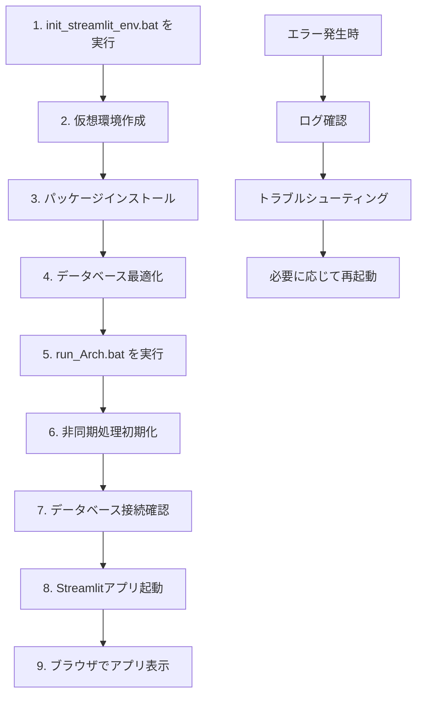

# QCアリケン東京システム バッチ起動手順書

## 1. 初期セットアップ

### 1.1 環境準備

#### UV環境を使用する場合（推奨）

1. **UVのインストール**（初回のみ）
   - Windows: `winget install --id=astral-sh.uv -e` または
   - PowerShell: `powershell -ExecutionPolicy ByPass -c "irm https://astral.sh/uv/install.ps1 | iex"`

2. **UV環境の初期化**
   - `Batch_file/init_uv_env.bat` をダブルクリックして実行します。
   - 初回のみ実行してください。
   - UV環境（`.venv`）の作成と必要なパッケージのインストールが行われます。
   - 従来のpip/venvより高速にインストールされます。
   - コマンドプロンプトが開き、「初期設定が完了しました。」と表示されたらEnterキーを押して閉じてください。

#### 従来のvenv環境を使用する場合

1. `Batch_file/init_streamlit_env.bat` をダブルクリックして実行します。
    - 初回のみ実行してください。
    - 仮想環境の作成と必要なパッケージのインストールが行われます。
    - 非同期処理対応のライブラリも自動インストールされます。
    - コマンドプロンプトが開き、「初期設定が完了しました。」と表示されたらEnterキーを押して閉じてください。

### 1.2 データベース最適化

1. 初回起動時に自動的にデータベース最適化が実行されます。
    - 最適化テーブルの作成
    - インデックスの構築
    - 既存データの移行（該当する場合）

### 1.3 設定確認

1. `data/master/` フォルダに必要なマスターファイルが配置されていることを確認
    - `employee_code.xlsx`: 従業員コード
    - その他のマスターデータ

## 2. アプリの起動

### 2.1 基本起動

#### UV環境を使用する場合（推奨）

1. `Batch_file/run_uv.bat` をダブルクリックして実行します。
    - UV環境（`.venv`）が有効化され、Streamlitアプリが起動します。
    - 非同期処理対応により、起動時間が短縮されます。
    - ブラウザが自動で開き、QCアリケン東京のメインメニュー画面が表示されます。

#### 従来のvenv環境を使用する場合

1. `Batch_file/run_Arch.bat` をダブルクリックして実行します。
    - 仮想環境が有効化され、Streamlitアプリが起動します。
    - 非同期処理対応により、起動時間が短縮されます。
    - ブラウザが自動で開き、QCアリケン東京のメインメニュー画面が表示されます。

### 2.2 起動確認事項

- データベース接続の確認
- 最適化テーブルの存在確認
- ログファイルの初期化

## 3. 運用時の注意事項

### 3.1 日常運用

- 2回目以降は「2.1 基本起動」だけでOKです。
- パッケージを追加・更新した場合は、再度 `init_uv_env.bat`（UV環境の場合）または `init_streamlit_env.bat`（従来のvenv環境の場合）を実行してください。
- データベース最適化は自動実行されます。

### 3.2 エラー対応

- エラーが出る場合は、コマンドプロンプトの内容を確認し、管理者にご連絡ください。
- ログファイルは `logs/` フォルダに保存されます。
- データベースエラーの場合は、自動復旧機能が動作します。

### 3.3 パフォーマンス監視

- 非同期処理により、レスポンス時間が改善されています。
- データベース最適化により、検索速度が向上しています。
- メモリ使用量の監視が自動実行されます。

## 4. トラブルシューティング

### 4.1 よくある問題と対処法

#### 4.1.1 アプリが起動しない

- 仮想環境が正しく作成されているか確認
- 必要なパッケージがインストールされているか確認
- ポート番号の競合がないか確認

#### 4.1.2 データベースエラー

- データベースファイルの権限を確認
- ディスク容量を確認
- 最適化テーブルの再作成を実行

#### 4.1.3 ファイルアップロードエラー

- ファイル形式が正しいか確認（.xlsx）
- ファイルサイズを確認
- ファイルの破損がないか確認

### 4.2 ログ確認方法

1. `logs/` フォルダ内のログファイルを確認
2. エラーログの詳細を管理者に報告
3. 必要に応じてログローテーションを実行

## 5. バックアップ・復旧

### 5.1 データバックアップ

- データベースファイルの定期バックアップ
- ログファイルのアーカイブ
- 設定ファイルのバックアップ

### 5.2 復旧手順

1. バックアップファイルの復元
2. データベース整合性の確認
3. アプリケーションの再起動

## 6. セキュリティ

### 6.1 アクセス制御

- ファイルパーミッションの適切な設定
- データベースファイルの暗号化
- ログファイルの保護

### 6.2 監査ログ

- アクセスログの記録
- 操作ログの保持
- 異常検知の実装

---

## 起動フロー図

## 7. 更新履歴

- **2025-01-XX**: UV環境対応（高速パッケージインストール）
- **2024-01-XX**: 非同期処理対応
- **2024-01-XX**: データベース最適化機能追加
- **2024-01-XX**: エラーハンドリング強化
- **2024-01-XX**: パフォーマンス監視機能追加
