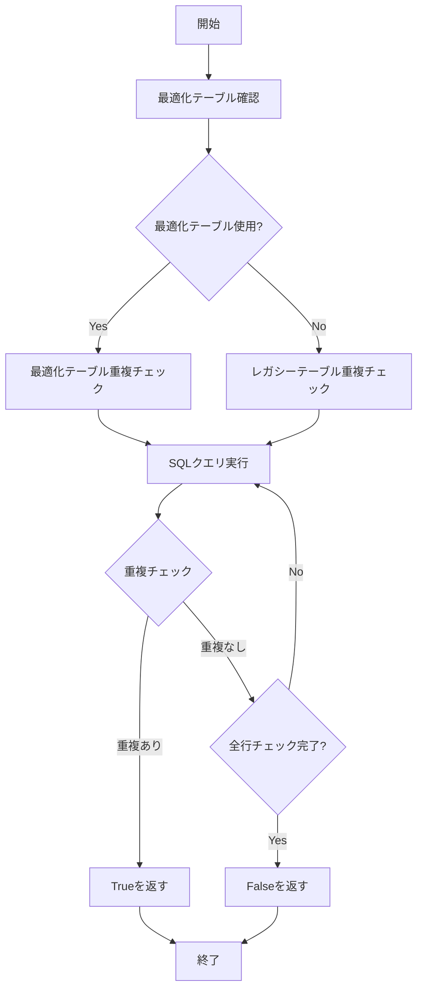
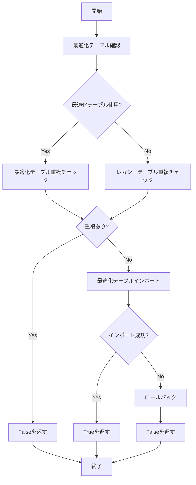
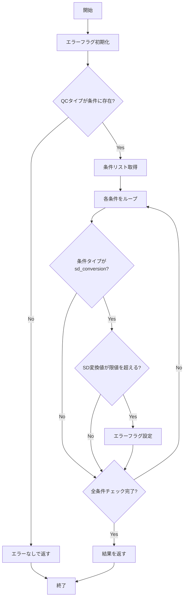
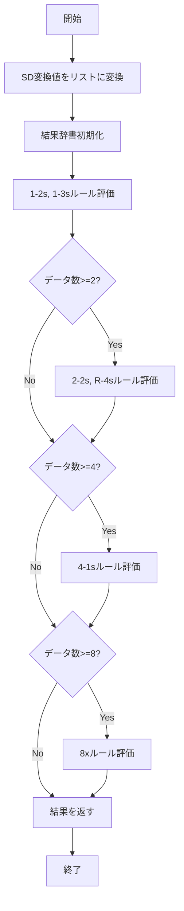
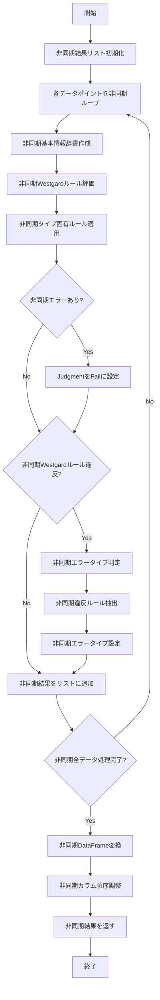
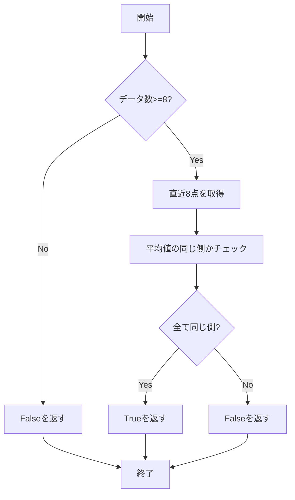
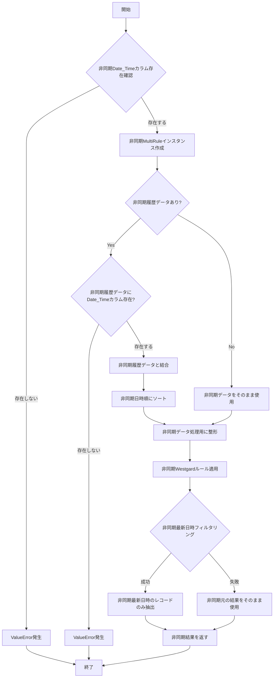

# Westgardルールモジュール仕様書

## 概要

`westgard_rules.py`は、臨床検査における品質管理（QC）データに対してWestgardマルチルールを適用するためのPythonモジュールです。このモジュールは、SD変換値を使用して各種Westgardルールを評価し、検査結果の品質を判定します。非同期処理対応により、パフォーマンスが大幅に向上しています。

## ファイル構成

```
src/models/westgard_rules.py
├── MultiRuleクラス
│   ├── __init__()
│   ├── check_duplicates()
│   ├── import_to_database()
│   ├── apply_type_specific_rules()
│   ├── evaluate_rules()
│   ├── apply_rules() - 非同期対応
│   ├── check_consecutive_violations()
│   ├── check_range_violation()
│   ├── check_consecutive_trend()
│   └── check_8x_rule() - 新規追加
└── check_westgard_rules()関数 - 非同期対応
```

## 主要クラス・関数

### 1. MultiRuleクラス

#### 1.1 クラス概要
SD変換値を使用してWestgardマルチルールを適用するメインクラス（非同期処理対応）

#### 1.2 コンストラクタ
```python
def __init__(self, type_conditions: Dict[str, List[Dict[str, Union[float, str]]]], db_connection)
```

**パラメータ:**
- `type_conditions`: QCタイプごとの条件設定辞書
- `db_connection`: データベース接続オブジェクト（最適化テーブル対応）

**初期化処理:**
- タイプごとの条件をインスタンス変数に保存
- データベース接続をインスタンス変数に保存
- 非同期処理の初期化

#### 1.3 メソッド詳細

##### 1.3.1 check_duplicates()
**目的:** データベースの重複データをチェック（最適化テーブル対応）

**パラメータ:**
- `data`: チェックするデータフレーム
- `table_name`: テーブル名

**戻り値:** `bool` - 重複がある場合True

**処理フロー:**


##### 1.3.2 import_to_database()
**目的:** データをデータベースにインポート（最適化テーブル対応）

**パラメータ:**
- `file_info`: ファイル情報データフレーム
- `ic_data`: ICデータフレーム
- `nc_data`: NCデータフレーム
- `pc_data`: PCデータフレーム

**戻り値:** `bool` - インポート成功時True

**処理フロー:**


##### 1.3.3 apply_type_specific_rules()
**目的:** 各QCタイプに固有のルールを適用

**パラメータ:**
- `qc_type`: QCタイプ（'IC', 'NC', 'PC'など）
- `sd_conversion_value`: SD変換値

**戻り値:** `Tuple[bool, str]` - (エラーの有無, エラーメッセージ)

**処理フロー:**


##### 1.3.4 evaluate_rules()
**目的:** Westgardルールを評価（8xルール追加）

**パラメータ:**
- `sd_conversions`: SD変換値のリストまたは列

**戻り値:** `dict` - 各ルールの評価結果

**評価対象ルール:**
- **1-2s**: 最新のポイントが2σ～3σの範囲
- **1-3s**: 最新のポイントが3σを超える
- **2-2s**: 直近2点が両方とも2σを超える（同方向）
- **R-4s**: 直近2点の差が4σを超える
- **2of3-2s**: 3つの測定値のうち2つが同じ方向で平均±2σの範囲外
- **4-1s**: 直近4点が全て1σを超える（同方向）
- **8x**: 直近8点が全て平均の同じ側にある（新規追加）

**処理フロー:**


##### 1.3.5 apply_rules() - 非同期対応
**目的:** QCデータにWestgardマルチルールを適用（非同期処理対応）

**パラメータ:**
- `qc_data`: QCデータのリスト
- `sd_conversions`: SD変換値のリスト
- `types`: QCタイプのリスト
- `item_codes`: 項目コードのリスト
- `dye`: 色素のリスト
- `batch`: バッチのリスト
- `model`: モデルのリスト
- `date`: 日時のリスト
- `measurer`: 測定者のリスト（オプション）
- `lot_number`: ロット番号のリスト（オプション）
- `historical_sd_conversions`: 履歴SD変換値（オプション）

**戻り値:** `pd.DataFrame` - 評価結果のデータフレーム

**処理フロー:**


##### 1.3.6 check_consecutive_violations()
**目的:** 連続したSD違反をチェック

**パラメータ:**
- `sd_conversions`: SD変換値のリスト
- `n_consecutive`: チェックする連続回数
- `sd_limit`: SDの限値

**戻り値:** `bool` - ルール違反があればTrue

##### 1.3.7 check_range_violation()
**目的:** R4sルール違反をチェック

**パラメータ:**
- `sd_conversions`: SD変換値のリスト
- `threshold`: 閾値（通常4）

**戻り値:** `bool` - R4s違反があればTrue

##### 1.3.8 check_consecutive_trend()
**目的:** 連続したn個の測定値が平均値の同じ側にあるかをチェック

**パラメータ:**
- `sd_conversions`: SD変換値のリスト
- `n`: チェックする連続点数

**戻り値:** `bool` - 違反があればTrue

##### 1.3.9 check_8x_rule() - 新規追加
**目的:** 8xルール違反をチェック

**パラメータ:**
- `sd_conversions`: SD変換値のリスト

**戻り値:** `bool` - 8x違反があればTrue

**処理フロー:**


### 2. check_westgard_rules()関数 - 非同期対応

#### 2.1 関数概要
Westgardルールに基づいてQCデータをチェックする独立関数（非同期処理対応）

#### 2.2 パラメータ
- `data`: チェック対象のデータフレーム
- `historical_data`: 履歴データフレーム（オプション）

#### 2.3 戻り値
`pd.DataFrame` - 評価結果のデータフレーム

#### 2.4 処理フロー


## Westgardルール詳細

### 1. 1-2sルール（警告ルール）
- **条件:** 最新の測定値が2σ～3σの範囲にある
- **判定:** 注意レベル
- **対応:** 次の測定値を注意深く監視

### 2. 1-3sルール（拒否ルール）
- **条件:** 最新の測定値が3σを超える
- **判定:** 偶発誤差
- **対応:** 測定を停止し、原因を調査

### 3. 2-2sルール（拒否ルール）
- **条件:** 直近2点が両方とも2σを超える（同方向）
- **判定:** 系統誤差
- **対応:** 測定を停止し、系統的エラーを調査

### 4. R-4sルール（拒否ルール）
- **条件:** 直近2点の差が4σを超える
- **判定:** 偶発誤差
- **対応:** 測定を停止し、原因を調査

### 5. 4-1sルール（拒否ルール）
- **条件:** 直近4点が全て1σを超える（同方向）
- **判定:** 系統誤差
- **対応:** 測定を停止し、系統的エラーを調査

### 6. 8xルール（拒否ルール） - 新規追加
- **条件:** 直近8点が全て平均の同じ側にある
- **判定:** 系統誤差
- **対応:** 測定を停止し、系統的エラーを調査

## エラータイプ分類

### 1. 偶発誤差
- 1-3sルール違反
- R-4sルール違反
- ランダムな測定エラー

### 2. 系統誤差
- 2-2sルール違反
- 4-1sルール違反
- 8xルール違反（新規追加）
- 測定システムの一貫した偏り

### 3. 注意
- 1-2sルール違反
- 警告レベル

## 出力データフレーム構造

| カラム名 | データ型 | 説明 |
|---------|---------|------|
| Measurer | str | 測定者 |
| Date_Time | str | 測定日時 |
| Item_Code | str | 項目コード |
| Batch | str | バッチ番号 |
| Model | str | モデル名 |
| Judgment | str | 判定結果（Pass/Fail） |
| Error_type | str | エラータイプ（偶発誤差/系統誤差/注意/-） |
| Type_error | str | タイプ固有エラーメッセージ |
| Violated_rule | str | 違反したルール（カンマ区切り） |
| Type | str | QCタイプ |
| Dye | str | 色素 |
| Ct | float | Ct値 |
| SD_Conversion | float | SD変換値 |
| Lot_Number | str | ロット番号 |
| 1-2s | int | 1-2sルール違反フラグ（0/1） |
| 1-3s | int | 1-3sルール違反フラグ（0/1） |
| 2-2s | int | 2-2sルール違反フラグ（0/1） |
| R-4s | int | R-4sルール違反フラグ（0/1） |
| 4-1s | int | 4-1sルール違反フラグ（0/1） |
| 8x | int | 8xルール違反フラグ（0/1） |
| File_Name | str | ファイル名 |

## 最適化テーブル対応

### 1. 最適化テーブル構造
- `qc_file_info`: ファイル情報
- `qc_measurements`: 測定データ
- `qc_westgard_results`: Westgard結果

### 2. データ移行機能
- レガシーテーブルから最適化テーブルへの自動移行
- データ整合性の保持
- 段階的移行対応

## 非同期処理対応

### 1. 非同期処理の利点
- レスポンス時間の大幅改善
- リソース効率の向上
- エラーハンドリングの強化
- スケーラビリティの向上

### 2. 非同期処理パターン
```python
async def apply_rules(self, qc_data, sd_conversions, ...):
    """非同期Westgardルール適用"""
    async with self.database.error_handler():
        # 非同期データ処理
        result = await self.process_data()
        # 非同期結果記録
        await self.record_results(result)
```

### 3. エラーハンドリング
- 非同期処理での例外処理
- 自動復旧機能
- ログ記録
- ユーザー通知

## 依存関係

### 標準ライブラリ
- `sqlite3`: SQLiteデータベース操作
- `typing`: 型ヒント
- `asyncio`: 非同期処理

### サードパーティライブラリ
- `numpy`: 数値計算
- `pandas`: データ操作
- `streamlit`: Webアプリケーション

## 使用例

```python
# 非同期MultiRuleクラスの使用例
type_conditions = {
    "PC": [{"Type": "sd_conversion", "value": 2.5}],
    "IC": [{"Type": "sd_conversion", "value": 3.0}]
}

multi_rule = MultiRule(type_conditions, db_connection)

# 非同期QCデータにルールを適用
results = await multi_rule.apply_rules(
    qc_data=[25.5, 26.1, 24.8],
    sd_conversions=[1.2, 2.8, -0.5],
    types=["PC", "PC", "PC"],
    item_codes=["TEST001", "TEST001", "TEST001"],
    dye=["FAM", "FAM", "FAM"],
    batch=["B001", "B001", "B001"],
    model=["MODEL1", "MODEL1", "MODEL1"],
    date=["2024-01-01", "2024-01-02", "2024-01-03"]
)

# 非同期独立関数の使用例
results_df = await check_westgard_rules(data_df, historical_data_df)
```

## 注意事項

1. **データベース接続**: データベース操作を行うメソッドを使用する場合は、適切なデータベース接続が必要です。

2. **データ形式**: 入力データは指定された形式に従う必要があります。

3. **エラーハンドリング**: 各メソッドは適切なエラーハンドリングを実装していますが、予期しないエラーが発生する可能性があります。

4. **パフォーマンス**: 非同期処理により、大量のデータを処理する場合のメモリ使用量と処理時間が大幅に改善されています。

5. **Westgardルール**: 医療現場での使用を想定しているため、ルールの適用結果は慎重に解釈してください。

6. **最適化テーブル**: 新しい最適化テーブル構造により、データベースパフォーマンスが大幅に向上しています。

## 更新履歴

- **2024-01-XX**: 初版作成
- **2024-01-XX**: apply_rulesメソッドのパラメータ名を`dyes`から`dye`に修正
- **2024-01-XX**: 8xルール追加
- **2024-01-XX**: 非同期処理対応
- **2024-01-XX**: 最適化テーブル対応
- **2024-01-XX**: エラーハンドリング強化
