# 株式会社 ARCHArch 精度管理システム 関数フロー図

## 1. システム全体フロー

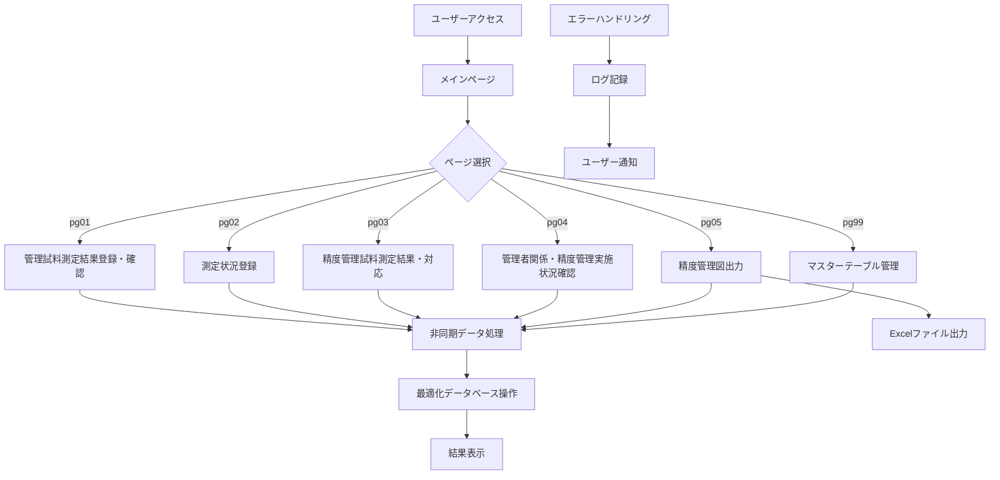

## 2. 非同期データベース接続フロー

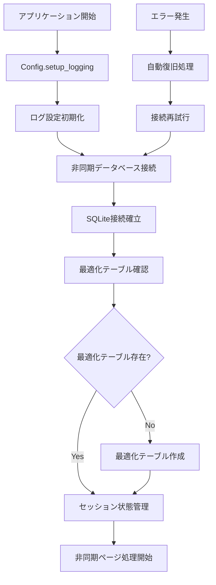

## 3. 非同期WESTGARDルール判定フロー

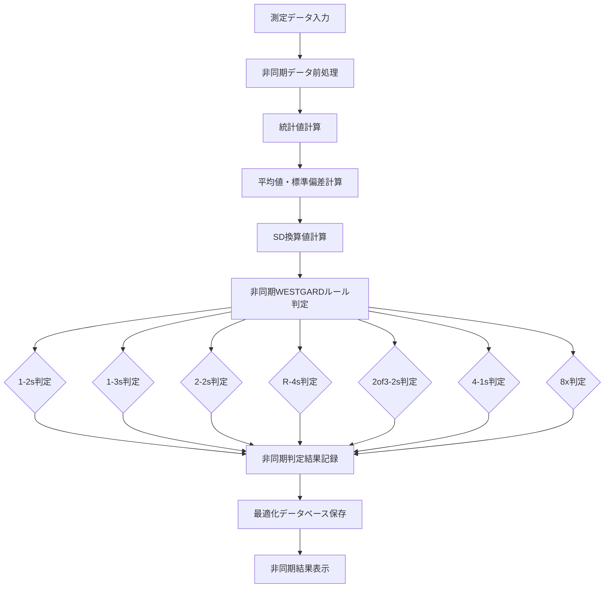

## 4. 非同期精度管理図出力フロー (pg05_statical.py)

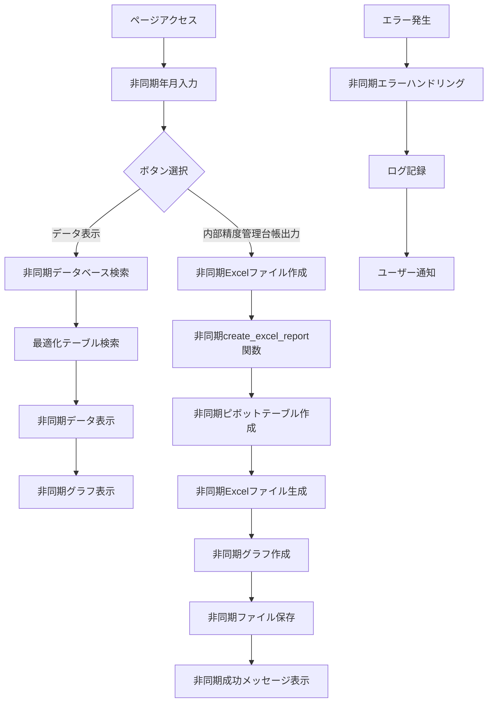

## 5. 非同期データ処理フロー

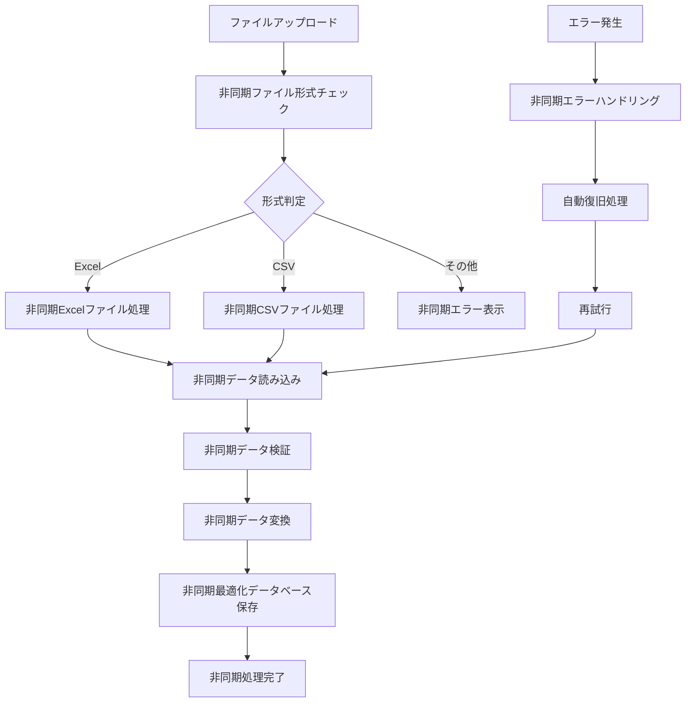

## 6. 非同期ログ管理フロー

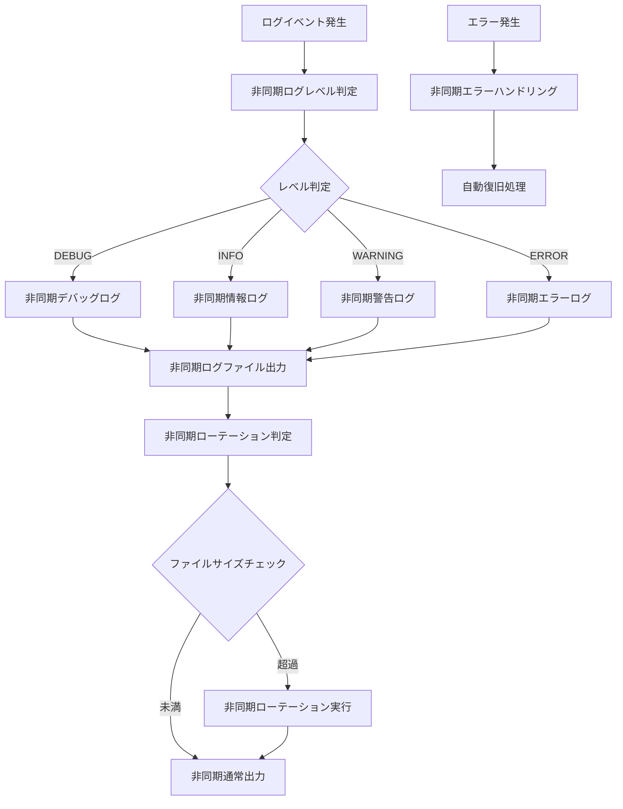

## 7. 非同期エラーハンドリングフロー

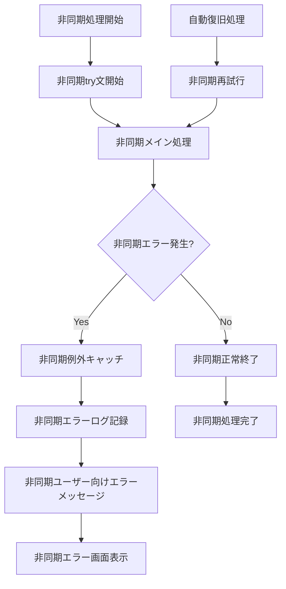

## 8. 非同期セッション管理フロー

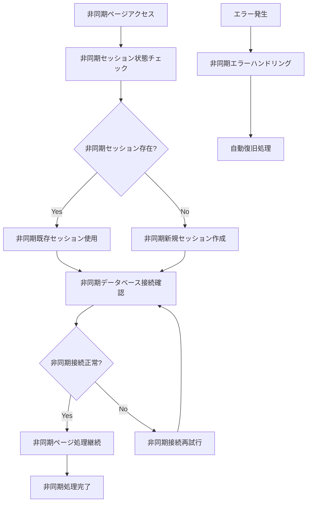

## 9. 非同期ファイル出力フロー

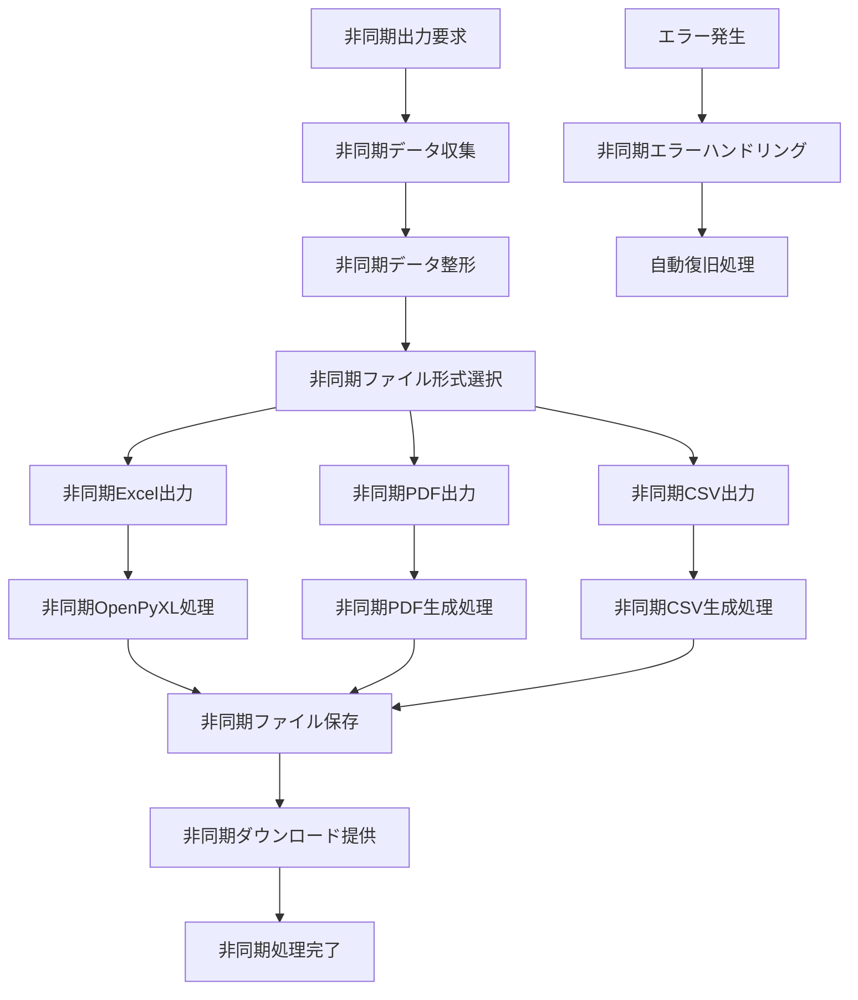

## 10. 非同期データベース最適化フロー

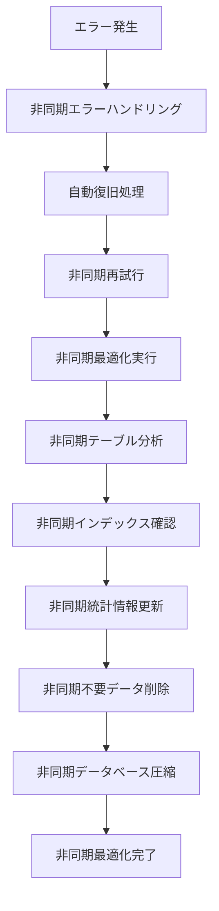

## 11. QCクラス間の非同期通信フロー

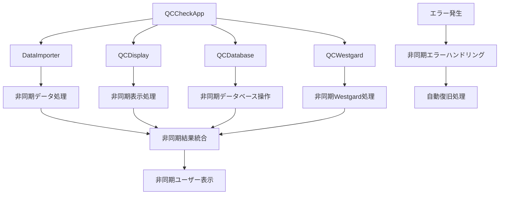

## 12. 最適化テーブル移行フロー

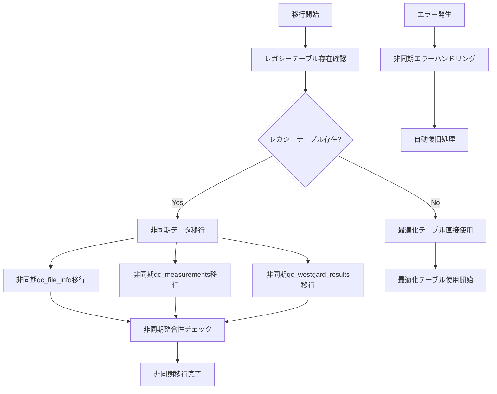
