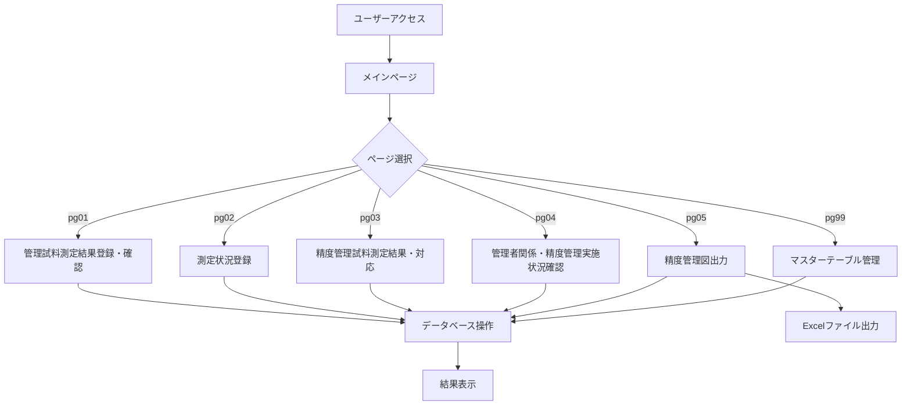
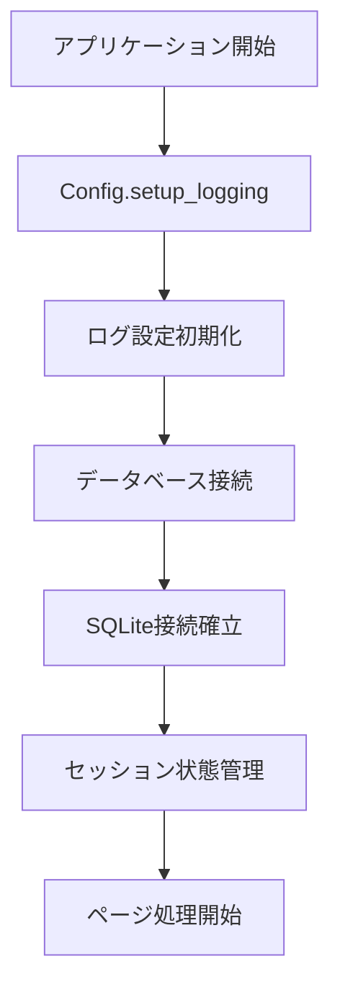
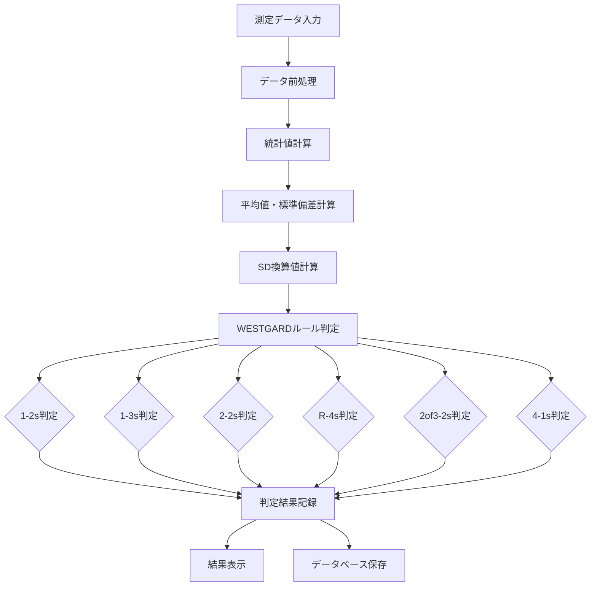
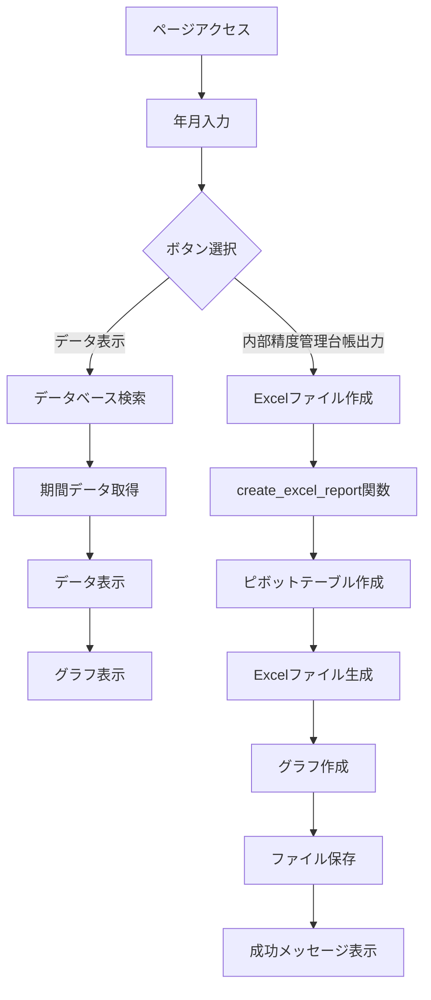
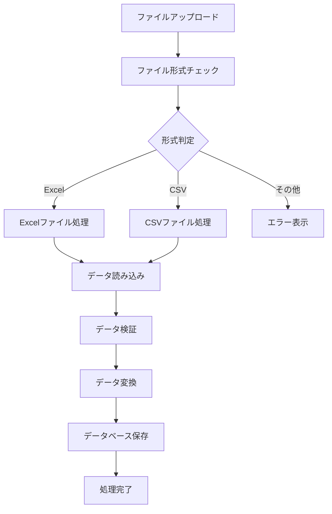
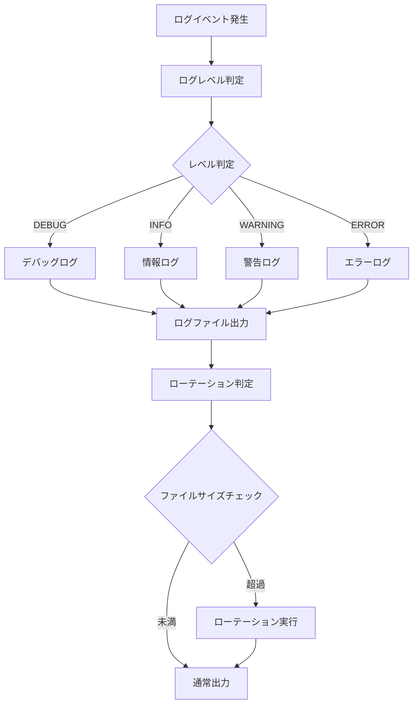
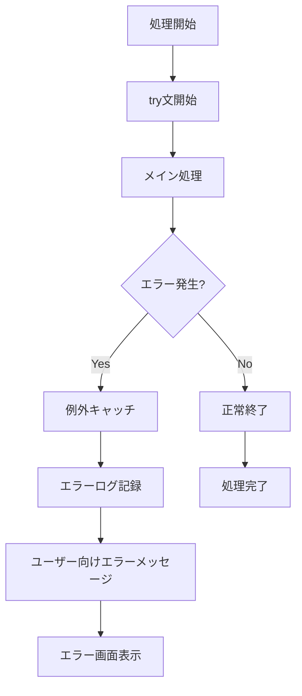
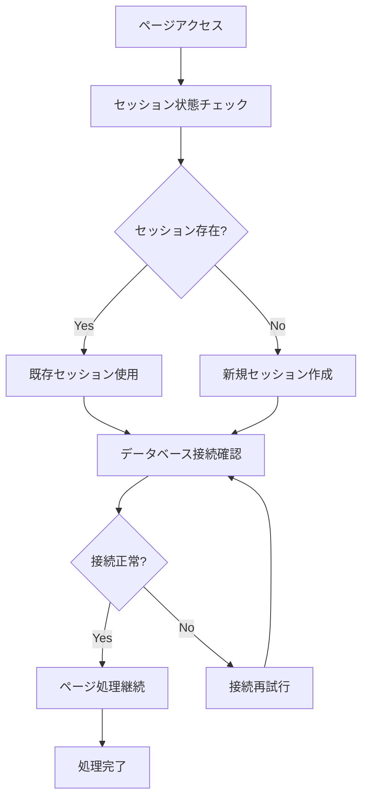
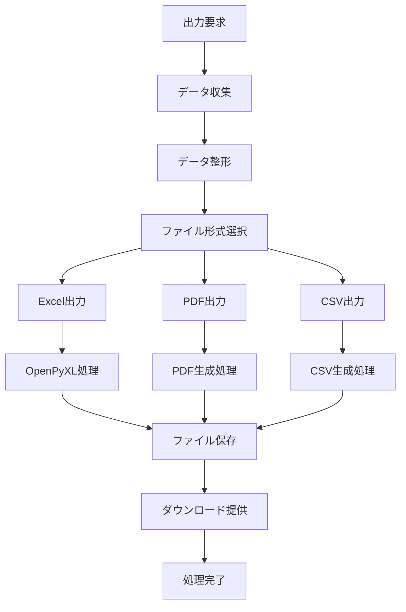
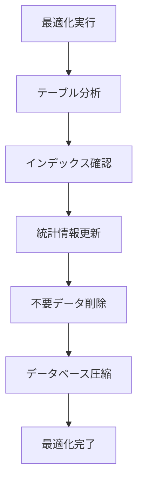

# 有研東京検査所 精度管理システム 関数フロー図

## 1. システム全体フロー

## 2. データベース接続フロー

## 3. WESTGARDルール判定フロー

## 4. 精度管理図出力フロー (pg05_statical.py)

## 5. データ処理フロー

## 6. ログ管理フロー

## 7. エラーハンドリングフロー

## 8. セッション管理フロー

## 9. ファイル出力フロー

## 10. データベース最適化フロー

